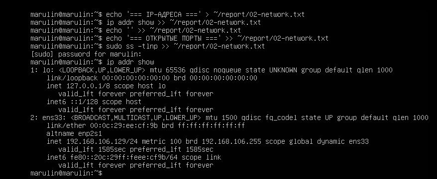
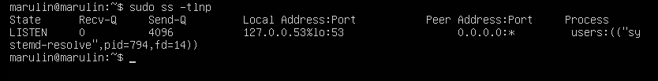
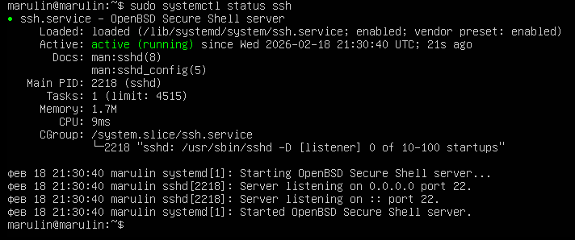
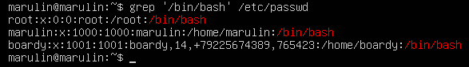
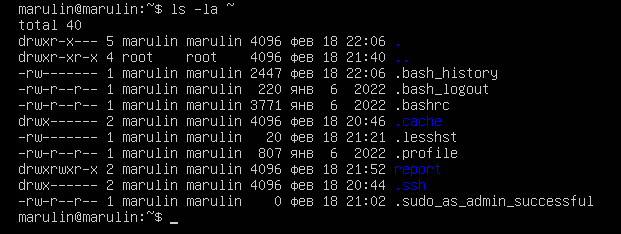
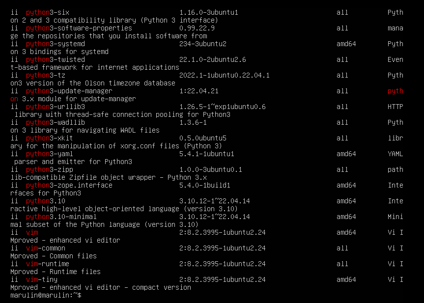
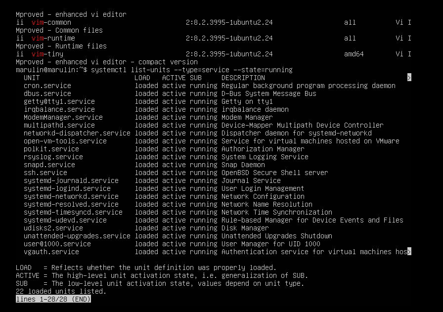

                            Отчет по Практической работе №1

Задание 2

свободные порты есть

Задание 3

Задание 4

Задание 5
основные каталоги: bin, boot, dev, etc, home, root, tmp, usr, var
etc - конфиги
var - веб, логи
home - папка пользователя
tmp - временные файлы

Задание 6
На /etc/shadow права 640(-rw-r-----), для того чтобы хэши паролей не были доступны всем пользователям
При chmod 755: владелец может читать, писать, выполнять. Остальные - читать, выполнять
При chmod 600: доступ только для владельца(читать, писать)

Задание 7
Всего пакетов - 619

