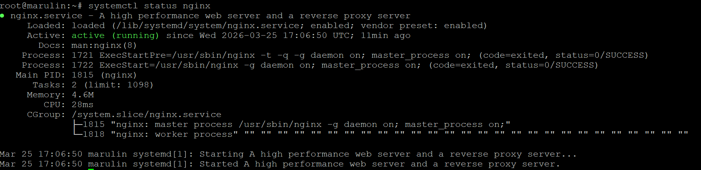
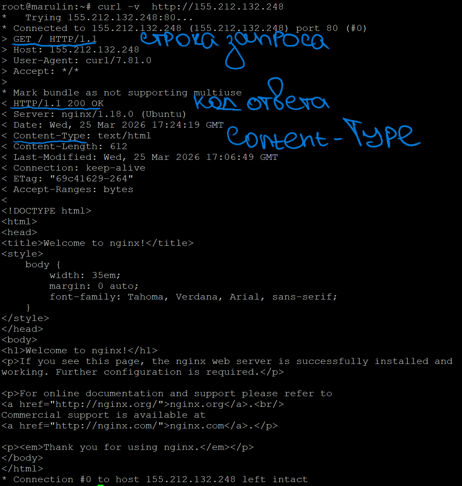
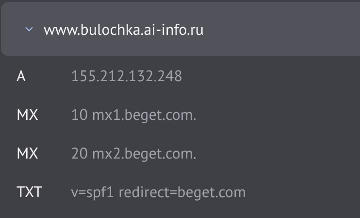
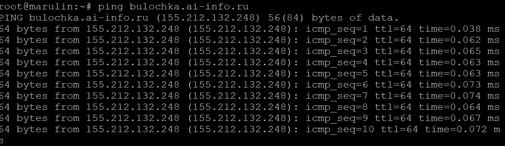
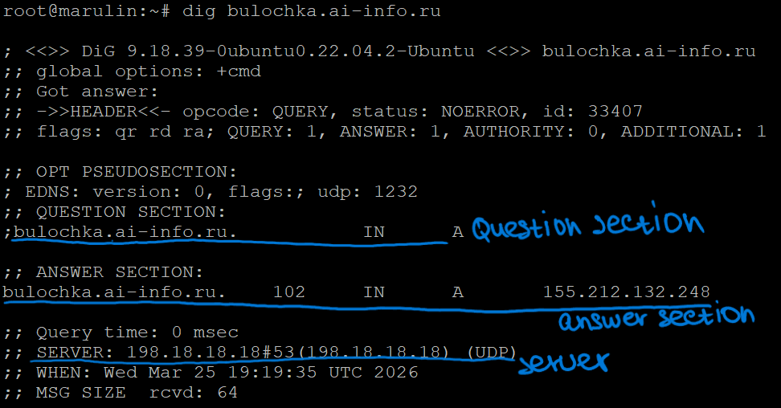
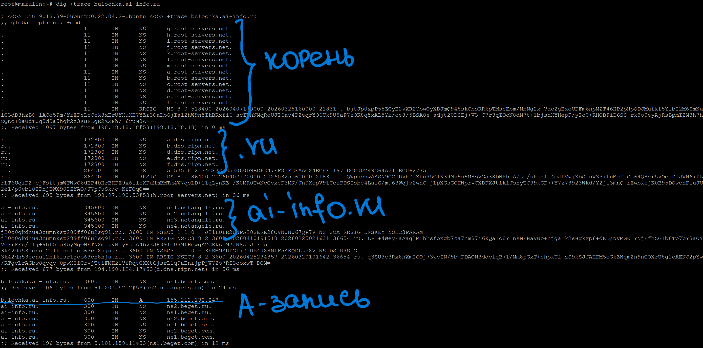
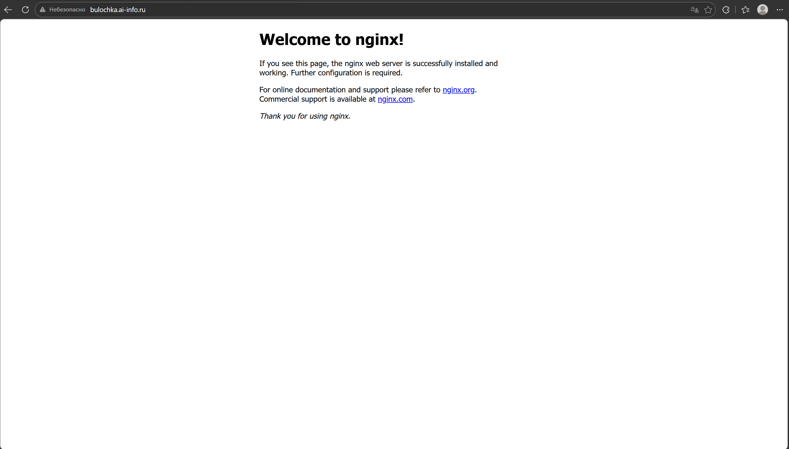

5 задание
listen - на каком порту слушааем
root - корень сервера, по которому ходит nginx по умолчанию
server_name - непосредственно имя сервера
insex - он помогает nginx'у найти файл(например, главной странички), в том случае, когда в пути не указан конкретный файл, то есть nginx по умолчанию возьмет файлик, который там указан и отдаст пользвателю

